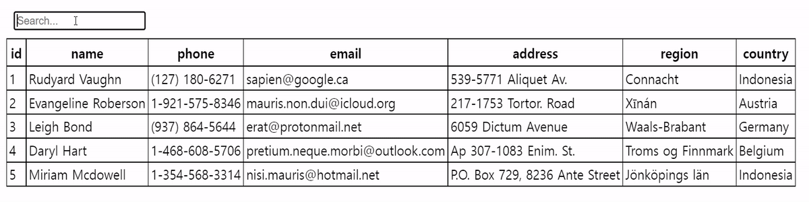

# 📕 Table Highlight

- 테이블(Table)에서 검색어(Search Text)를 찾아 강조 표시합니다.
- Locate and highlight the search term in the table.


## 🏷️ 기능(Function)

- [Row Highlighting](#Row-Highlighting)
- [Text Highlighting](#Text-Highlighting)

## 💡 사용 예제(Usage Example)

### Example

```html
<input type="search" placeholder="Search..." title="search" oninput="rowHighlight(this.value,'#TableBody','tr','#0AA1DD','#FFF')">
```

### Description

```html
<input type="search" placeholder="Search..." title="search" oninput="rowHighlight({0},{1},{2},{3},{4})">
```

- {0} : HTML `<input>` Tag Value(Search Text)
- {1} : HTML `<table>` Or `<tbody>` Tag ID
- {2} : HTML `<tr>` Tag
- {3} : Background Color(Hex color codes)
- {4} : Foreground Color(Hex color codes)

### Row Highlighting

[Example](#Example)

### Text Highlighting

- To use this feature, you must have the value you want to find in the `<div>` tag.

```html
    <tr>
        <td>
            <div>Rudyard Vaughn</div>
        </td>
        <td>
            <div>(127) 180-6271</div>
        </td>
        <td>
            <div>sapien@google.ca</div>
        </td>
        <td>
            <div>539-5771 Aliquet Av.</div>
        </td>
        <td>
            <div>Connacht</div>
        </td>
        <td>
            <div>Indonesia</div>
        </td>
    </tr>
```

### 🌐 브라우저 지원(Browser Support)

|Chrome|Microsoft Edge|Firefox|
|:-:|:-:|:-:|
|||
|`Latest` ✔|`Latest` ✔|`Latest` ✔|

## 🔍 정보(Information)

### 🖋️ 저자(Author)

- [yeong-hyeon-kim](https://github.com/yeong-hyeon-kim) – codechemi@gmail.com

### ⚖️ 라이센스(License)

- 다음 라이센스를 준수하며 [License](./License)에서 자세한 정보를 확인할 수 있습니다.

- You comply with the following licenses and can find more information in the [License](./License)

## 📖 비고(Remark)
